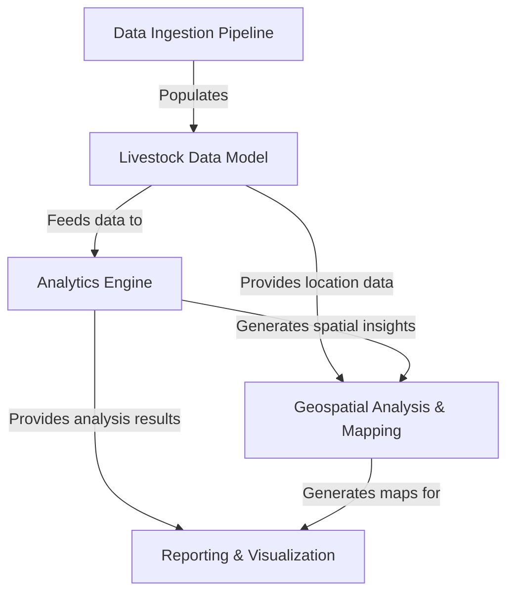
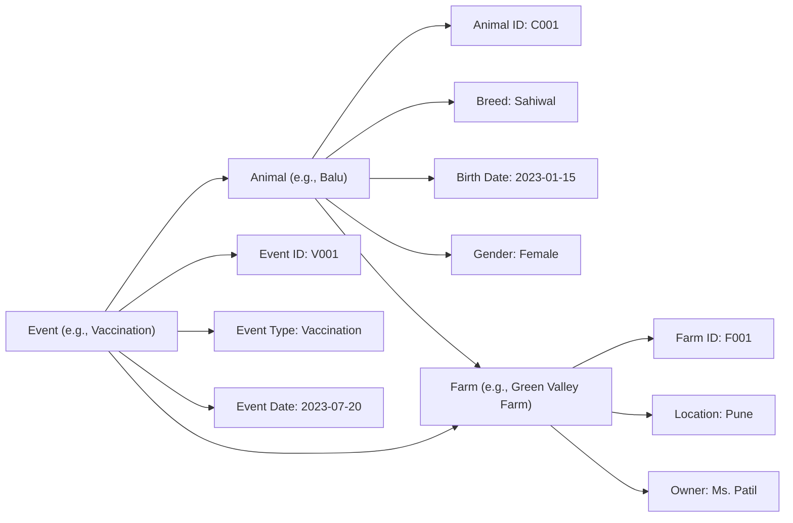
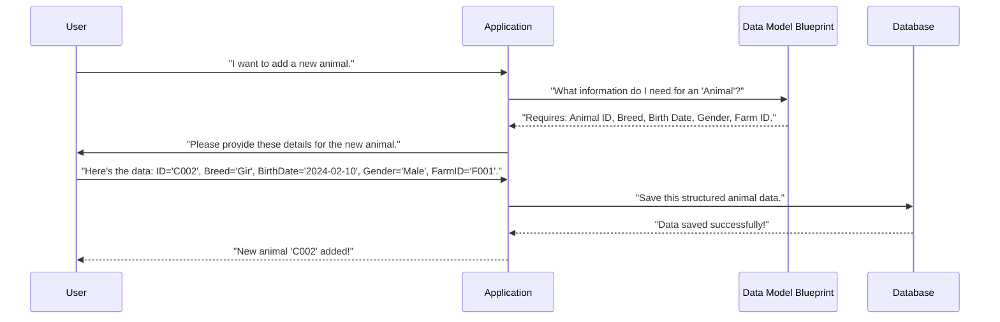
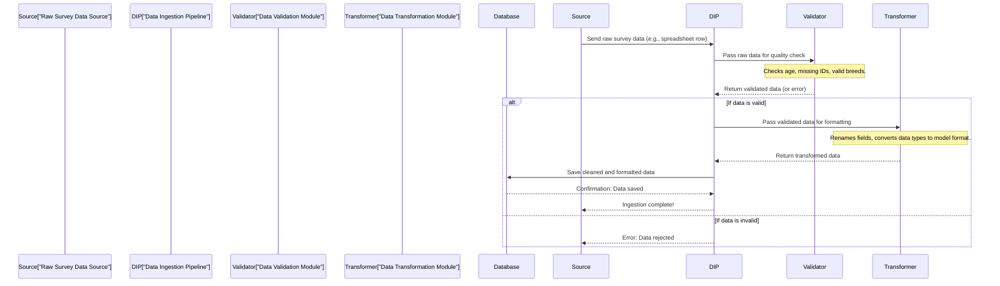
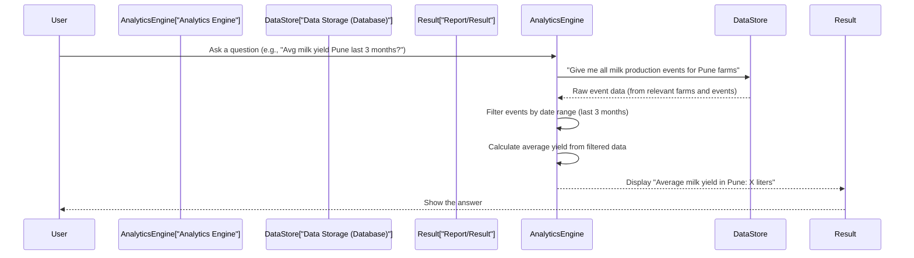
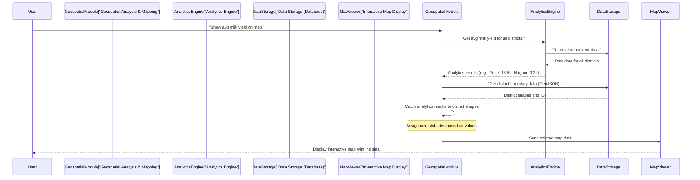
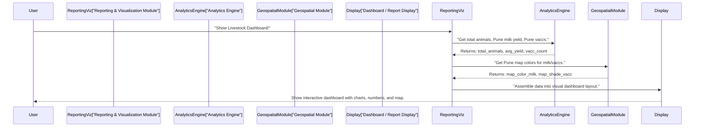

# Maharashtra-livestock-Analytics

This project is an advanced system designed to **understand and track livestock** across *Maharashtra*. It acts like a "smart farm manager" that **collects diverse animal and farm data**, then *cleans and organizes* it. With this structured data, it can **analyze patterns, predict trends, and pinpoint areas** of interest using *location intelligence*. Finally, all these complex insights are transformed into **easy-to-understand reports and maps** for decision-makers.


## Visual Overview



## Chapters

1. [Livestock Data Model
(01_livestock_data_model_.md)
2. [Data Ingestion Pipeline
(02_data_ingestion_pipeline_.md)
3. [Analytics Engine
](03_analytics_engine_.md)
   [Geospatial Analysis & Mapping
](04_geospatial_analysis___mapping_.md)
5. [Reporting & Visualization
](05_reporting___visualization_.md)

---

# Chapter 1: Livestock Data Model

Welcome to the **Maharashtra Livestock Analytics** project! This project aims to help us understand and manage livestock data better across Maharashtra. Think of it as a smart system for all things related to farm animals.

Before we can start doing cool analytics like finding out which breeds are most common or tracking vaccination rates, we need to agree on one very important thing: **How do we describe an animal? How do we describe a farm? How do we describe an event like a vaccination?**

Imagine you have a big notebook to write down information about all the animals on a farm. If everyone writes things down differently – one person writes "age", another "date of birth", and a third just "young" or "old" – it would be a mess! You'd never be able to count how many cows are exactly 2 years old.

This is where the **Livestock Data Model** comes in.

## What is a "Livestock Data Model"?

Think of the Livestock Data Model as the project's **"animal dictionary"** or **"farm blueprint."** It's a set of rules and a plan that tells us exactly what kind of information we will store about each animal, each farm, and every event that happens on the farm.

Its main job is to make sure all our data is:
1.  **Organized**: Everything has its proper place.
2.  **Consistent**: Everyone records information in the same way.
3.  **Clear**: We all understand what "cattle" or "milk production" means in our system.

### Our Central Use Case: Tracking an Animal's Life

Let's imagine our goal is to track a single cow, "Balu," from its birth, through vaccinations, to its eventual sale or milk production. Without a data model, this would be chaotic. With it, we have a clear path.

## Key Concepts of Our Data Model

To achieve our goal, our data model focuses on a few main "things" or "entities" that are important for livestock analytics:

### 1. Animals

This is information about the individual animals.
*   **Example**: Balu the cow, a specific goat, or a chicken.
*   **What we store**:
    *   A unique ID (like an Aadhaar card for animals!)
    *   Their breed (e.g., Sahiwal, Gir, Osmanabadi)
    *   Their age or date of birth
    *   Their gender (male/female)
    *   Which farm they live on

### 2. Farms

This is information about the places where animals live.
*   **Example**: A dairy farm near Pune, a goat farm in Nagpur.
*   **What we store**:
    *   A unique ID for the farm
    *   The name of the farm
    *   Its location (village, district)
    *   The owner's name

### 3. Events

These are things that happen to animals or on farms.
*   **Example**: A vaccination, an animal being born, an animal being sold, milk being produced.
*   **What we store**:
    *   A unique ID for the event
    *   What kind of event it was (e.g., "Vaccination," "Birth," "Sale")
    *   The date the event happened
    *   Which animal(s) were involved
    *   Which farm this event happened on

By having these three clear categories and defining what information goes into each, we create our "blueprint"!

## How the Data Model Helps Us Track "Balu"

Let's revisit our use case: tracking Balu.
When Balu is born, our data model tells us exactly what information we need to record for her as an `Animal`.
When Balu gets her first vaccination, the model tells us what to record for that `Event` and how to link it to Balu and her `Farm`.

The data model itself doesn't "do" anything active, but it guides *how* our system stores information. It ensures that when we talk about "cattle," we're always referring to data that has an ID, a breed, a birth date, and a linked farm.

Here’s a simple visual of how the data model helps organize information:



In this diagram:
*   `Animal` represents Balu. She has her unique details.
*   `Farm` represents where Balu lives. It also has unique details.
*   `Event` represents a vaccination. It happens to Balu and takes place at Green Valley Farm.

Notice how `Animal` is linked to `Farm`, and `Event` is linked to both `Animal` and `Farm`? This linking is crucial for consistent data!

## A Glimpse Under the Hood: How the Model Works in Our System

So, how does this "blueprint" translate into something a computer understands?

When you interact with our system (for example, to add a new animal), the system uses the data model's rules to make sure you provide all the necessary information and that it's stored correctly.

Here's a simplified step-by-step idea of what happens when you add a new animal:


In this flow, the `Data Model Blueprint` isn't a piece of code that runs, but rather a set of rules that the `Application` follows to ensure the data is complete and correctly formatted before it goes into the `Database`.

### Simple Code Examples (Illustrative)

In a real computer system, this "blueprint" is often represented using special structures like "classes" in programming languages or "tables" in a database. For this beginner tutorial, let's look at how we might *think* about storing this data using simple Python examples, even if it's not the exact project code yet.

#### Example: An Animal Record

```python
# This is how we define what an 'Animal' record should look like
class AnimalRecord:
    def __init__(self, animal_id, breed, birth_date, gender, farm_id):
        self.animal_id = animal_id
        self.breed = breed
        self.birth_date = birth_date # Format like 'YYYY-MM-DD'
        self.gender = gender
        self.farm_id = farm_id # Link to a Farm

# When we create an actual animal, we follow this structure
balu = AnimalRecord("C001", "Sahiwal", "2023-01-15", "Female", "F001")

print(f"Balu's Breed: {balu.breed}")
# Output: Balu's Breed: Sahiwal
```
This Python code shows how we create a template (`AnimalRecord`) and then use it to create specific animal entries (like `balu`). Every animal we create using this template will have `animal_id`, `breed`, `birth_date`, `gender`, and `farm_id`.

#### Example: A Farm Record

```python
class FarmRecord:
    def __init__(self, farm_id, name, location, owner_name):
        self.farm_id = farm_id
        self.name = name
        self.location = location # e.g., "Pune, Maharashtra"
        self.owner_name = owner_name

# Creating an actual farm record
green_valley_farm = FarmRecord("F001", "Green Valley Farm", "Pune", "Ms. Patil")

print(f"Farm Location: {green_valley_farm.location}")
# Output: Farm Location: Pune
```
Similarly, the `FarmRecord` ensures all farms have a consistent set of details.

#### Example: An Event Record (e.g., Vaccination)

```python
class EventRecord:
    def __init__(self, event_id, event_type, event_date, animal_id, farm_id, details=None):
        self.event_id = event_id
        self.event_type = event_type # e.g., "Vaccination", "Birth", "Sale"
        self.event_date = event_date
        self.animal_id = animal_id # Linked to an Animal
        self.farm_id = farm_id   # Linked to a Farm
        self.details = details   # Optional extra info

# Recording Balu's vaccination
balu_vaccination = EventRecord("V001", "Vaccination", "2023-07-20", "C001", "F001", "FMD Vaccine")

print(f"Event Type: {balu_vaccination.event_type} on {balu_vaccination.event_date}")
# Output: Event Type: Vaccination on 2023-07-20
```
Here, the `EventRecord` links back to the animal and the farm using their IDs, making sure we know exactly who was vaccinated and where.

These simple code snippets are like the rules our "animal dictionary" (the data model) provides. They ensure that all data is structured uniformly, making it incredibly easy to search, filter, and analyze later!

## Conclusion

In this chapter, we learned that the **Livestock Data Model** is our project's fundamental "animal dictionary" or "farm blueprint." It defines the core pieces of information we store about animals, farms, and events, ensuring consistency and organization across all our data. This structured approach is essential for any meaningful analysis.

Now that we understand *what* data we want to store and *how* to structure it, the next step is to actually get this data into our system. That's where the [Data Ingestion Pipeline](02_data_ingestion_pipeline_.md) comes in.

# Chapter 2: Data Ingestion Pipeline

In [Chapter 1: Livestock Data Model](01_livestock_data_model_.md), we learned how to create a "blueprint" or "dictionary" for our data. We defined exactly *what* information we need about animals, farms, and events, and *how* it should be structured to keep everything organized and consistent.

Now that we know what our perfect, clean data looks like, the big question is: **How do we actually get raw, messy information into this perfect, structured format within our system?**

Imagine you're trying to build a magnificent new house, and you have a detailed blueprint. But the building materials – wood, bricks, pipes – are scattered everywhere, some are dirty, some are oddly shaped, and some have wrong labels. You can't just throw them together! You need a process to gather the materials, clean them, cut them to size, and organize them before they can be used according to the blueprint.

This is exactly the problem our **Data Ingestion Pipeline** solves for our project.

## What is a "Data Ingestion Pipeline"?

Think of the Data Ingestion Pipeline as a special "data highway" with several "cleaning stations" and "shaping factories" along the way. Its job is to safely bring raw data from its original source into our system, making sure it follows the rules defined by our [Livestock Data Model](01_livestock_data_model_.md).

It's a step-by-step process that ensures all data arriving in our system is:
1.  **Collected** from different places.
2.  **Checked for errors** and cleaned up.
3.  **Transformed** into the correct format.
4.  **Loaded** into our database, ready for analysis.

### Our Central Use Case: Getting New Farm Survey Data

Let's imagine a common scenario for our project: The government conducts a new survey of livestock in a village. They send us a big spreadsheet file containing information about new farms and their animals. This is our "raw data."

Our goal is to take this raw spreadsheet data, ensure it's correct, and then store it in our system according to our [Livestock Data Model](01_livestock_data_model_.md).

## Key Concepts of the Data Ingestion Pipeline

Our data ingestion pipeline has a few crucial steps:

### 1. Data Collection: Gathering the Raw Materials

This is the first step, where we gather data from its original source.
*   **What it does**: It gets the raw data from wherever it lives.
*   **Examples of sources**:
    *   A government spreadsheet (like our use case).
    *   Information typed into a web form.
    *   Readings from a sensor on a farm.
    *   Reports from field workers.
*   **Analogy**: It's like sending trucks out to pick up raw materials from different suppliers.

### 2. Data Validation: The Quality Check

After collecting, we need to check if the data makes sense.
*   **What it does**: It looks for mistakes or inconsistencies in the raw data.
*   **Examples of checks**:
    *   Is an animal's age a positive number?
    *   Does a farm have a valid location?
    *   Is the breed name spelled correctly and does it exist in our known list of breeds?
    *   Are all required fields present (e.g., an animal must have an ID)?
*   **Analogy**: This is the "cleaning station" where we inspect materials, remove dirt, or reject broken pieces.

### 3. Data Transformation: Shaping to Our Blueprint

Once validated, the data needs to be shaped to fit our data model.
*   **What it does**: It changes the structure and format of the data to match our "animal dictionary" (the [Livestock Data Model](01_livestock_data_model_.md)).
*   **Examples of transformations**:
    *   Renaming a column from "Animal_Birth_Date" to `birth_date`.
    *   Converting a text field like "Male" or "Female" into a standardized code like `M` or `F`.
    *   Combining different pieces of information into one field.
*   **Analogy**: This is the "shaping factory" where raw materials are cut, molded, and assembled according to the blueprint specifications.

### 4. Data Loading: Storing It Away

Finally, the cleaned and transformed data is stored in our system.
*   **What it does**: It takes the perfectly formatted data and saves it into our database.
*   **Result**: The data is now ready for analytics, reports, and visualization.
*   **Analogy**: This is when the perfectly shaped and cleaned materials are carefully placed into their correct positions in our new building.

## How the Data Ingestion Pipeline Helps with Our Farm Survey Data

Let's walk through our use case: getting new farm survey data into our system.
Imagine we received a raw piece of data from a survey, representing a new animal:

```
# Raw data from a survey spreadsheet (conceptually a dictionary)
raw_survey_data = {
    "Animal_ID_Code": "C003",
    "Type_of_Animal": "cow",
    "Animal_Age_Years": "3",  # Age in years
    "Gender_of_Animal": "F",
    "Farm_Loc": "Nagpur Village",
    "Farm_Owner_Name": "Shri Sharma"
}
```
This is how the data might look *before* it enters our pipeline. Notice how the field names are different from our [Livestock Data Model](01_livestock_data_model_.md)'s `animal_id`, `breed`, `age`, `gender`, etc.

Here's how our pipeline processes it:

### Step 1: Collection (Conceptual)

Our pipeline would first "collect" this data. In a real system, this might involve reading a row from an Excel file, but for simplicity, let's assume `raw_survey_data` is already provided to the pipeline.

```python
# In a real system, this step would read data from a file or source.
# For this example, we'll imagine we've already "collected" this dictionary.
collected_data = raw_survey_data
print(f"Collected raw data: {collected_data}")

# Output:
# Collected raw data: {'Animal_ID_Code': 'C003', 'Type_of_Animal': 'cow', 'Animal_Age_Years': '3', 'Gender_of_Animal': 'F', 'Farm_Loc': 'Nagpur Village', 'Farm_Owner_Name': 'Shri Sharma'}
```
This step just means we've received the raw data.

### Step 2: Validation

Next, the pipeline checks this data for errors. What if `Animal_Age_Years` was "-3" or "abc"? Our validator would flag that!

```python
def validate_animal_data(data):
    # Check if Animal_Age_Years is a positive number
    try:
        age = int(data.get("Animal_Age_Years"))
        if age < 0:
            print("Validation Error: Age cannot be negative.")
            return False
    except ValueError:
        print("Validation Error: Age is not a number.")
        return False

    # Check for required fields (simplified)
    if not data.get("Animal_ID_Code"):
        print("Validation Error: Animal ID is missing.")
        return False
        
    print("Data validated successfully!")
    return True

# Let's run the validation
if validate_animal_data(collected_data):
    print("Data passed validation. Proceeding to transformation.")
else:
    print("Data failed validation. It will not be processed further.")

# Output:
# Data validated successfully!
# Data passed validation. Proceeding to transformation.
```
This simple function checks if the age is a valid positive number and if the ID is present. If it fails, the data won't go to the next stage.

### Step 3: Transformation

Now that the data is clean, we transform it to match our [Livestock Data Model](01_livestock_data_model_.md). Remember our model requires fields like `animal_id`, `breed`, `age_years`, `gender`, `farm_id`, `farm_name`, and `location`.

```python
def transform_to_model_format(raw_data):
    # Create a new dictionary that matches our data model
    transformed_data = {
        "animal_id": raw_data.get("Animal_ID_Code"),
        "breed": raw_data.get("Type_of_Animal"), # Assuming "cow" is a breed for simplicity
        "age_years": int(raw_data.get("Animal_Age_Years")),
        "gender": raw_data.get("Gender_of_Animal"),
        # For simplicity, let's create a Farm entry directly from this data
        "farm_details": {
            "farm_name": raw_data.get("Farm_Loc"), # Using location as farm name for this example
            "location": raw_data.get("Farm_Loc"),
            "owner_name": raw_data.get("Farm_Owner_Name")
        }
    }
    print(f"Transformed data: {transformed_data}")
    return transformed_data

# Transform our validated data
transformed_animal_data = transform_to_model_format(collected_data)

# Output:
# Transformed data: {'animal_id': 'C003', 'breed': 'cow', 'age_years': 3, 'gender': 'F', 'farm_details': {'farm_name': 'Nagpur Village', 'location': 'Nagpur Village', 'owner_name': 'Shri Sharma'}}
```
Notice how the keys like "Animal_ID_Code" are now `animal_id`, and "Animal_Age_Years" became `age_years` and its value is an `int` instead of a string. This ensures consistency with our `AnimalRecord` and `FarmRecord` from [Chapter 1: Livestock Data Model](01_livestock_data_model_.md).

### Step 4: Loading

Finally, the perfectly formatted data is ready to be loaded into our system's database.

```python
def load_data_to_database(data):
    # In a real system, this would involve saving to a database.
    # For this example, we'll just print a success message.
    print(f"Saving animal '{data['animal_id']}' and farm '{data['farm_details']['farm_name']}' to the database...")
    print("Data successfully loaded into the system!")

# Load the transformed data
load_data_to_database(transformed_animal_data)

# Output:
# Saving animal 'C003' and farm 'Nagpur Village' to the database...
# Data successfully loaded into the system!
```
Now, this new animal and farm information is stored correctly and can be used for analysis.

## A Glimpse Under the Hood: How the Pipeline Works

Let's look at the entire process in a simplified flow diagram.


In this diagram:
*   `Source` is where our raw data comes from (e.g., the government survey).
*   `DIP` (Data Ingestion Pipeline) is the orchestrator, guiding the data through the steps.
*   `Validator` checks for correctness.
*   `Transformer` changes the data's shape to fit our [Livestock Data Model](01_livestock_data_model_.md).
*   `Database` is where the final, clean data is stored.

This entire pipeline ensures that only high-quality, consistently formatted data makes it into our system, preventing bad data from corrupting our analysis.

## Conclusion

The **Data Ingestion Pipeline** is the robust system that gathers, cleans, formats, and stores raw data into our `Maharashtra-livestock-Analytics` project. It acts as a set of "data highways" and "cleaning stations," ensuring that messy raw information is transformed into the organized and consistent structure defined by our [Livestock Data Model](01_livestock_data_model_.md). With our data now safely and correctly stored, we are ready for the exciting part: analyzing it!

Next, we will explore [Chapter 3: Analytics Engine](03_analytics_engine_.md), where we'll learn how to ask questions and get insights from our clean livestock data.
# Chapter 3: Analytics Engine

In [Chapter 1: Livestock Data Model](01_livestock_data_model_.md), we designed our "animal dictionary" to structure our data. Then, in [Chapter 2: Data Ingestion Pipeline](02_data_ingestion_pipeline_.md), we built a "data highway" to collect, clean, and store all that raw information according to our dictionary's rules. Now, we have a treasure chest full of beautifully organized and clean livestock data!

But what's the point of having all this data if we can't learn anything from it? This is where the **Analytics Engine** comes into play.

Imagine you have a huge library filled with books. Just having the books isn't enough; you want to read them, understand their stories, and find answers to your questions. Our Analytics Engine is like the "smart reader" or "expert detective" for our livestock data.

## What is the "Analytics Engine"?

The Analytics Engine is the project's **"smart calculator"** or **"insight generator."** Once our livestock data is clean and stored (thanks to the previous chapters!), this part of our system takes over to find interesting patterns, spot important trends, and even make smart guesses about what might happen next.

It's designed to answer questions that are not immediately obvious by just looking at raw numbers. For example:
*   "What's the average milk yield of cows in the Pune district?"
*   "How many animals were vaccinated against Foot-and-Mouth Disease (FMD) in Nagpur last month?"
*   "Is a certain animal disease spreading faster in one region compared to another?"

The Analytics Engine uses special mathematical tools and smart instructions (called algorithms) to dig into the data and pull out these valuable insights.

### Our Central Use Case: Getting Answers from Data

Let's consider our main goal for this chapter: We want to answer two important questions about our livestock:

1.  **Average Milk Production**: What is the average milk yield (in liters) for all milk-producing animals in the **Pune district** over the last three months?
2.  **Vaccination Count**: How many animals received *any* vaccination in the **Pune district** during the last month?

These are the kinds of practical questions that can help farmers, veterinarians, and government officials make better decisions.

## Key Powers of Our Analytics Engine

To answer questions like our central use case, the Analytics Engine has a few main abilities:

### 1. Statistical Analysis: Asking Questions and Getting Numbers

This is the engine's ability to perform calculations on our data.
*   **What it does**: It calculates things like total counts, averages, sums, minimums, and maximums.
*   **Example**: Counting how many animals of a certain breed exist, summing up total milk produced, or finding the average age of animals on a farm.
*   **Analogy**: It's like using a powerful calculator that can look at thousands of numbers at once and instantly tell you their average or total.

### 2. Trend Identification: Spotting Changes Over Time

This power helps us see if things are getting better, worse, or staying the same.
*   **What it does**: It looks at data collected over time to identify if there's an upward movement (increasing), a downward movement (decreasing), or if things are stable.
*   **Example**: Observing if the number of vaccinated animals is increasing month-over-month, or if milk production goes up during certain seasons.
*   **Analogy**: Imagine looking at a series of photos taken every month. A trend identifier tells you if a plant is growing taller, shrinking, or staying the same size.

### 3. Basic Prediction: Guessing What Might Happen Next (High-Level)

This is a more advanced capability, but the Analytics Engine lays the groundwork for it.
*   **What it does**: Using past patterns and trends, it tries to estimate or forecast future outcomes.
*   **Example**: If a disease spread follows a certain pattern in the past, the engine might suggest areas where it could appear next.
*   **Analogy**: Just like a weather forecaster uses past weather data (temperature, wind, rain) to predict if it will rain tomorrow, our engine uses livestock data to make informed guesses. For this beginner chapter, we'll keep this as a conceptual idea, without showing complex prediction code.

## Solving Our Use Cases with the Analytics Engine

Let's see how our Analytics Engine tackles our central use cases using the data we've prepared.
For our examples, we'll imagine our clean data from previous chapters is available as simple lists of Python dictionaries, just like a simplified version of our "database."

First, let's set up some sample data that resembles what our [Data Ingestion Pipeline](02_data_ingestion_pipeline_.md) would have stored:

```python
import datetime

# --- Sample Data (Simulating our clean database) ---
# Farms data
farms_data = [
    {"farm_id": "F001", "name": "Green Valley Farm", "location": "Pune", "owner_name": "Ms. Patil"},
    {"farm_id": "F002", "name": "Sharma Dairy", "location": "Nagpur", "owner_name": "Shri Sharma"},
    {"farm_id": "F003", "name": "Gokul Dairy", "location": "Pune", "owner_name": "Mr. Deshmukh"},
]

# Events data (including milk production and vaccinations)
events_data = [
    # Milk Production in Pune
    {"event_id": "M001", "event_type": "Milk Production", "event_date": "2024-03-05", "farm_id": "F001", "details": {"yield_liters": 15}},
    {"event_id": "M002", "event_type": "Milk Production", "event_date": "2024-03-10", "farm_id": "F003", "details": {"yield_liters": 12}},
    {"event_id": "M003", "event_type": "Milk Production", "event_date": "2024-02-15", "farm_id": "F001", "details": {"yield_liters": 14}},
    {"event_id": "M004", "event_type": "Milk Production", "event_date": "2024-02-20", "farm_id": "F003", "details": {"yield_liters": 11}},
    {"event_id": "M005", "event_type": "Milk Production", "event_date": "2024-01-25", "farm_id": "F001", "details": {"yield_liters": 16}},
    {"event_id": "M006", "event_type": "Milk Production", "event_date": "2024-01-30", "farm_id": "F003", "details": {"yield_liters": 13}},
    # Milk Production in Nagpur (not part of our use case for average)
    {"event_id": "M007", "event_type": "Milk Production", "event_date": "2024-03-01", "farm_id": "F002", "details": {"yield_liters": 10}},

    # Vaccinations in Pune (last month: March, assuming current date is in April 2024)
    {"event_id": "V001", "event_type": "Vaccination", "event_date": "2024-03-10", "farm_id": "F001", "details": "FMD Vaccine"},
    {"event_id": "V002", "event_type": "Vaccination", "event_date": "2024-03-20", "farm_id": "F003", "details": "Rabies Vaccine"},
    {"event_id": "V003", "event_type": "Vaccination", "event_date": "2024-03-25", "farm_id": "F001", "details": "FMD Booster"},
    # Vaccination in Pune (not last month)
    {"event_id": "V004", "event_type": "Vaccination", "event_date": "2024-02-01", "farm_id": "F001", "details": "Brucellosis Vaccine"},
    # Vaccination in Nagpur (not part of our use case for count)
    {"event_id": "V005", "event_type": "Vaccination", "event_date": "2024-03-15", "farm_id": "F002", "details": "FMD Vaccine"},
]

# Assume "today" is April 1st, 2024, for "last month" calculations
today_date = datetime.date(2024, 4, 1)
```
This sample data includes different events and farms, allowing us to filter and calculate.

### Use Case 1: Average Milk Yield in Pune District (Last 3 Months)

To calculate this, the Analytics Engine needs to:
1.  **Find Farms**: Identify all farms located in "Pune".
2.  **Filter Events**: Look for "Milk Production" events linked to these Pune farms.
3.  **Time Filter**: Select only events that happened in the last 3 months.
4.  **Calculate Average**: Extract the `yield_liters` and compute their average.

```python
# Function to get average milk yield
def get_avg_milk_yield(district, days_ago, all_events, all_farms):
    # 1. Find farms in the specified district
    district_farm_ids = {f["farm_id"] for f in all_farms if f["location"] == district}

    # 2. Set the date range for the last 'days_ago'
    min_date = today_date - datetime.timedelta(days=days_ago)

    total_milk_yield = 0
    milk_records_count = 0

    for event in all_events:
        # 3. Filter for Milk Production events in the right date range and district
        if (event["event_type"] == "Milk Production" and
            event["farm_id"] in district_farm_ids and
            datetime.datetime.strptime(event["event_date"], "%Y-%m-%d").date() >= min_date):
            
            total_milk_yield += event["details"]["yield_liters"]
            milk_records_count += 1
            
    if milk_records_count > 0:
        return total_milk_yield / milk_records_count
    return 0 # No milk records found

# Calculate for Pune district, last 3 months (approx 90 days)
avg_yield = get_avg_milk_yield("Pune", 90, events_data, farms_data)
print(f"Average milk yield in Pune (last 3 months): {avg_yield:.2f} liters")

# Output: Average milk yield in Pune (last 3 months): 13.50 liters
```
This code snippet shows how we first identify the relevant farms, then loop through events, apply multiple filters (event type, farm location, and date), and finally perform the average calculation.

### Use Case 2: Animals Vaccinated in Pune District (Last Month)

For this, the Analytics Engine needs to:
1.  **Find Farms**: Identify all farms located in "Pune".
2.  **Filter Events**: Look for "Vaccination" events linked to these Pune farms.
3.  **Time Filter**: Select only events that happened in the *last month*.
4.  **Count**: Count how many such events occurred.

```python
# Function to count vaccinations
def count_vaccinations_last_month(district, all_events, all_farms):
    # 1. Find farms in the specified district
    district_farm_ids = {f["farm_id"] for f in all_farms if f["location"] == district}

    # 2. Determine the date range for "last month" (March 2024 in our example)
    # This logic assumes 'today_date' is the 1st of the current month.
    last_month_end = today_date - datetime.timedelta(days=1)
    last_month_start = last_month_end.replace(day=1)

    vaccination_count = 0
    for event in all_events:
        event_date_obj = datetime.datetime.strptime(event["event_date"], "%Y-%m-%d").date()
        
        # 3. Filter for Vaccination events in the right date range and district
        if (event["event_type"] == "Vaccination" and
            event["farm_id"] in district_farm_ids and
            last_month_start <= event_date_obj <= last_month_end):
            
            vaccination_count += 1
            
    return vaccination_count

# Calculate for Pune district, last month
vaccinated_animals_count = count_vaccinations_last_month("Pune", events_data, farms_data)
print(f"Number of vaccinations in Pune (last month): {vaccinated_animals_count} events")

# Output: Number of vaccinations in Pune (last month): 3 events
```
Here, the engine again filters by farm location, event type, and crucially, a specific monthly date range. The `count_vaccinations_last_month` function correctly identifies the 3 vaccination events in Pune that occurred in March 2024.

These examples show how our Analytics Engine uses filtering, calculations, and time-based logic to turn raw data into meaningful answers.

## A Glimpse Under the Hood: How the Analytics Engine Works (Simplified)

When you ask the Analytics Engine a question, a series of steps happen behind the scenes:



In this diagram:
*   The `User` asks a question.
*   The `Analytics Engine` receives the question and knows which data it needs.
*   It then requests that data from our `Data Storage` (which stores the clean data from our [Data Ingestion Pipeline](02_data_ingestion_pipeline_.md)).
*   Once it gets the raw numbers, the `Analytics Engine` does all the hard work of filtering, calculating, and making sense of them.
*   Finally, it presents the clear `Result` back to the user.

### Simple Code Structure for the Engine

In a real project, the Analytics Engine might be a Python class with different methods for different types of analysis. Here’s a very simplified idea:

```python
class SimpleAnalyticsEngine:
    def __init__(self, all_farms, all_events):
        self.farms = all_farms
        self.events = all_events
        self.today = datetime.date(2024, 4, 1) # Our assumed "current" date

    def get_farms_by_location(self, district):
        # This method fetches farm IDs for a given district
        return {f["farm_id"] for f in self.farms if f["location"] == district}

    def calculate_average_milk_yield(self, district, month_range):
        # Calls the internal logic we saw earlier
        days_ago = month_range * 30 # Simple approx. for months
        district_farm_ids = self.get_farms_by_location(district)
        min_date = self.today - datetime.timedelta(days=days_ago)

        total_yield = 0
        count = 0
        for event in self.events:
            event_date = datetime.datetime.strptime(event["event_date"], "%Y-%m-%d").date()
            if (event["event_type"] == "Milk Production" and
                event["farm_id"] in district_farm_ids and
                event_date >= min_date):
                total_yield += event["details"]["yield_liters"]
                count += 1
        return total_yield / count if count > 0 else 0

    def count_vaccinations(self, district, target_month_offset):
        # target_month_offset: 0 for current month, 1 for last month, etc.
        district_farm_ids = self.get_farms_by_location(district)

        # Calculate start/end date for the target month
        current_month = self.today.month
        current_year = self.today.year
        
        target_month_year = current_year
        target_month = current_month - target_month_offset
        if target_month <= 0: # Handle year change
            target_month += 12
            target_month_year -= 1

        first_day_of_target_month = self.today.replace(year=target_month_year, month=target_month, day=1)
        # Last day of target month (trick: first day of next month minus one day)
        if target_month == 12:
            first_day_of_next_month = self.today.replace(year=target_month_year + 1, month=1, day=1)
        else:
            first_day_of_next_month = self.today.replace(year=target_month_year, month=target_month + 1, day=1)
        last_day_of_target_month = first_day_of_next_month - datetime.timedelta(days=1)

        vacc_count = 0
        for event in self.events:
            event_date = datetime.datetime.strptime(event["event_date"], "%Y-%m-%d").date()
            if (event["event_type"] == "Vaccination" and
                event["farm_id"] in district_farm_ids and
                first_day_of_target_month <= event_date <= last_day_of_target_month):
                vacc_count += 1
        return vacc_count

# --- Using our Analytics Engine ---
engine = SimpleAnalyticsEngine(farms_data, events_data)

# Ask for average milk yield in Pune for last 3 months
avg_milk = engine.calculate_average_milk_yield("Pune", 3)
print(f"Using Engine: Avg milk yield in Pune (last 3 months): {avg_milk:.2f} liters")

# Ask for vaccinations in Pune last month (1 month offset)
vacc_count = engine.count_vaccinations("Pune", 1) 
print(f"Using Engine: Vaccinations in Pune (last month): {vacc_count} events")

# Expected Output:
# Using Engine: Avg milk yield in Pune (last 3 months): 13.50 liters
# Using Engine: Vaccinations in Pune (last month): 3 events
```
This `SimpleAnalyticsEngine` class wraps our logic into reusable functions (called methods). When you want an insight, you simply call the right method on the engine, and it handles fetching, filtering, and calculating for you. This makes it easy to ask many different questions without rewriting the logic every time.

## Conclusion

The **Analytics Engine** is the powerful brain of our `Maharashtra-livestock-Analytics` project. It transforms raw, structured data into meaningful answers, helping us understand patterns, trends, and even glimpse into the future. By using statistical methods and clever algorithms, it empowers users to make informed decisions about livestock management, disease control, and resource allocation.

Now that we can extract valuable insights from our data, the next exciting step is to see these insights visually on a map! In [Chapter 4: Geospatial Analysis & Mapping](04_geospatial_analysis___mapping_.md), we will learn how to show where these trends and counts are happening across Maharashtra.

---
# Chapter 4: Geospatial Analysis & Mapping

In [Chapter 1: Livestock Data Model](01_livestock_data_model_.md), we designed the blueprint for our animal data. Then, in [Chapter 2: Data Ingestion Pipeline](02_data_ingestion_pipeline_.md), we built a system to gather and clean this data. Finally, in [Chapter 3: Analytics Engine](03_analytics_engine_.md), we learned how to ask smart questions and get numerical answers from our clean data, like "What's the average milk yield in Pune?" or "How many vaccinations happened in Nagpur?"

Now, imagine looking at those numbers on a spreadsheet. It's useful, but wouldn't it be even more powerful if we could **see** these insights directly on a map of Maharashtra? This is where our "smart map reader," the **Geospatial Analysis & Mapping** component, comes into play!

## What is "Geospatial Analysis & Mapping"?

Think of this as the project's **"smart map reader."** Since we're focused on "Maharashtra," this part of our system deals with anything related to location. It allows us to:
*   **Understand where livestock are located**: Pinpoint farms on a map.
*   **Track disease outbreaks visually**: See "hotspots" where diseases might be spreading.
*   **Visualize data by district or region**: Color areas on a map based on specific data, helping us instantly see patterns tied to specific places.

Its main job is to turn raw location data and analytics results into easy-to-understand visual maps. Instead of just seeing a number, you'll see **where** that number is relevant.

### Our Central Use Case: Visualizing Insights on a Map

Let's take the insights we gained from our [Analytics Engine](03_analytics_engine_.md) and put them on a map. Our goal is to:

1.  **Map Average Milk Yield**: Show which districts in Maharashtra have higher or lower average milk production (e.g., color districts greener for higher yield, lighter for lower).
2.  **Map Vaccination Counts**: Highlight districts with a higher number of vaccinations in the last month (e.g., make them darker blue).

These visual maps can help government officials quickly identify regions needing more support or resources, without having to dig through tables of numbers.

## Key Concepts of Geospatial Analysis & Mapping

To achieve our use case, our system needs to understand a few core ideas:

### 1. Geospatial Data: The Map's Addresses and Shapes

This is the foundational information about places on Earth.
*   **What it is**: It's data that describes the location, shape, and boundaries of real-world objects. Think of it as the digital version of a physical map.
*   **Examples**:
    *   **Points**: A farm's exact location (latitude and longitude, like `18.5204° N, 73.8567° E` for Pune).
    *   **Shapes/Polygons**: The boundaries of a district, showing exactly where Pune district starts and ends.
*   **Analogy**: It's like having a detailed address book for every village and district in Maharashtra, including their exact footprint on the ground.

### 2. Linking Data to Geography: Connecting Numbers to Places

Our numerical data (like milk yield) is just numbers. This step connects those numbers to the actual places on the map.
*   **What it does**: It matches our `Farm` and `Event` data (which have `location` fields like "Pune") to the `Geospatial Data` (which knows the exact shape of "Pune" district).
*   **Analogy**: Imagine you have a list of scores for different teams. This step is like drawing a line from each team's score to its specific city on a big world map.

### 3. Mapping and Visualization: Drawing on the Smart Map

This is the final step where everything comes together visually.
*   **What it does**: It takes the linked data and displays it on an interactive map. We can color areas, place markers, or draw routes to represent our insights.
*   **Example**: Coloring the Pune district green if its average milk yield is high, or placing a red dot on a village where a disease outbreak was reported.
*   **Analogy**: This is like taking your marked-up world map and using different colored pens to highlight cities with high scores (e.g., green for good scores, red for low scores), making patterns instantly visible.

## Solving Our Use Cases with Geospatial Analysis & Mapping

Let's use our sample data and analytics results from [Chapter 3: Analytics Engine](03_analytics_engine_.md) to see how we'd visualize them.

First, let's recall the results we got from the Analytics Engine:
*   Average milk yield in Pune (last 3 months): `13.50 liters`
*   Number of vaccinations in Pune (last month): `3 events`

Now, we need some simplified **Geospatial Data** for Maharashtra districts. For this beginner tutorial, we'll represent districts as simple entries that our mapping system can "recognize."

```python
# Sample Geospatial Data (simplified for districts)
# In a real system, this would be complex boundary files (GeoJSON, Shapefiles)
district_map_data = {
    "Pune": {"boundary_id": "PUNE001", "center_coords": (18.52, 73.85)},
    "Nagpur": {"boundary_id": "NAGP001", "center_coords": (21.14, 79.08)},
    "Nashik": {"boundary_id": "NASHK001", "center_coords": (19.99, 73.78)},
    # ... many more districts ...
}

# --- Sample Analytics Results (as if from Analytics Engine) ---
# For our visualization, we need results for multiple districts to show variety.
# Let's imagine we ran the Analytics Engine for more districts:

analytics_results = {
    "Pune": {
        "avg_milk_yield": 13.50,
        "vaccination_count": 3
    },
    "Nagpur": {
        "avg_milk_yield": 9.20,  # Lower than Pune
        "vaccination_count": 8   # Higher than Pune
    },
    "Nashik": {
        "avg_milk_yield": 16.10, # Higher than Pune
        "vaccination_count": 2   # Lower than Pune
    }
}
```

### Use Case 1: Mapping Average Milk Yield

To show milk yield on a map, we'd go through these steps:
1.  **Get Analytics Results**: We already have these for each district.
2.  **Assign Visual Properties**: Decide how to color each district based on its milk yield (e.g., define color ranges).
3.  **Render on Map**: Use our `district_map_data` to conceptually "draw" and "color" the districts.

```python
def get_color_for_milk_yield(yield_liters):
    if yield_liters >= 15.0:
        return "Deep Green" # High yield
    elif yield_liters >= 10.0:
        return "Light Green" # Medium yield
    else:
        return "Yellow"      # Lower yield

print("--- Visualizing Average Milk Yield by District ---")
for district, data in analytics_results.items():
    milk_yield = data["avg_milk_yield"]
    color = get_color_for_milk_yield(milk_yield)
    # In a real system, this would draw on an actual map.
    print(f"District: {district} | Avg Milk Yield: {milk_yield:.2f} L | Map Color: {color}")

# Output:
# --- Visualizing Average Milk Yield by District ---
# District: Pune | Avg Milk Yield: 13.50 L | Map Color: Light Green
# District: Nagpur | Avg Milk Yield: 9.20 L | Map Color: Yellow
# District: Nashik | Avg Milk Yield: 16.10 L | Map Color: Deep Green
```
This simplified output shows how districts would be assigned different colors based on their average milk yield, making it easy to spot high-producing areas (Deep Green) versus lower-producing ones (Yellow).

### Use Case 2: Mapping Vaccination Counts

Similarly, for vaccinations:
1.  **Get Analytics Results**: Use the vaccination counts per district.
2.  **Assign Visual Properties**: Decide how to shade each district based on its vaccination count.
3.  **Render on Map**: "Draw" and "shade" the districts.

```python
def get_shade_for_vaccination_count(count):
    if count >= 5:
        return "Dark Blue"    # High vaccination count
    elif count >= 3:
        return "Medium Blue"  # Medium vaccination count
    else:
        return "Light Blue"   # Lower vaccination count

print("\n--- Visualizing Vaccination Counts by District ---")
for district, data in analytics_results.items():
    vacc_count = data["vaccination_count"]
    shade = get_shade_for_vaccination_count(vacc_count)
    # Again, conceptually drawing on a map.
    print(f"District: {district} | Vaccinations: {vacc_count} | Map Shade: {shade}")

# Output:
# --- Visualizing Vaccination Counts by District ---
# District: Pune | Vaccinations: 3 | Map Shade: Medium Blue
# District: Nagpur | Vaccinations: 8 | Map Shade: Dark Blue
# District: Nashik | Vaccinations: 2 | Map Shade: Light Blue
```
Here, Nagpur stands out as "Dark Blue" for having a high number of vaccinations, while Nashik is "Light Blue" with fewer. This instantly draws attention to areas that might be doing well (or perhaps have a high need for vaccinations) at a glance.

## A Glimpse Under the Hood: How Geospatial Analysis & Mapping Works

When you ask our system to show data on a map, a series of steps happen:



In this diagram:
*   The `User` asks for a map visualization.
*   The `Geospatial Analysis & Mapping` module coordinates the process.
*   It first asks the `Analytics Engine` for the numbers it needs to display.
*   It also fetches the actual `Data Storage` (database) for the geographic boundaries of districts.
*   It then combines the numerical results with the map shapes, decides how to color or mark the map, and sends this information to an `Interactive Map Display` (like a web application).
*   Finally, the `Map Viewer` shows the visually rich map to the `User`.

### Simple Code Structure for the Geospatial Module

In a real project, the Geospatial Analysis & Mapping part would use specialized libraries (like GeoPandas, Folium, or Leaflet in Python/JavaScript) to handle complex map data and interactive displays. For our simplified view, let's imagine a class that brings our conceptual `district_map_data` and analytics results together.

```python
class SimpleMapVisualizer:
    def __init__(self, map_data):
        self.map_data = map_data # Our conceptual district_map_data

    def _get_color_for_milk_yield(self, yield_liters):
        if yield_liters >= 15.0: return "Deep Green"
        elif yield_liters >= 10.0: return "Light Green"
        else: return "Yellow"

    def _get_shade_for_vaccination_count(self, count):
        if count >= 5: return "Dark Blue"
        elif count >= 3: return "Medium Blue"
        else: return "Light Blue"

    def visualize_milk_yield(self, analytics_results):
        print("\n[Visualizing Milk Yield on Map]")
        for district, data in analytics_results.items():
            if district in self.map_data:
                color = self._get_color_for_milk_yield(data["avg_milk_yield"])
                # In a real app, this would update a map library.
                print(f"  Coloring {district} ({self.map_data[district]['boundary_id']}) with {color} for {data['avg_milk_yield']:.2f}L.")
            else:
                print(f"  Warning: No map data for {district}.")

    def visualize_vaccinations(self, analytics_results):
        print("\n[Visualizing Vaccinations on Map]")
        for district, data in analytics_results.items():
            if district in self.map_data:
                shade = self._get_shade_for_vaccination_count(data["vaccination_count"])
                # In a real app, this would update a map library.
                print(f"  Shading {district} ({self.map_data[district]['boundary_id']}) with {shade} for {data['vaccination_count']} events.")
            else:
                print(f"  Warning: No map data for {district}.")

# --- Using our Map Visualizer ---
map_visualizer = SimpleMapVisualizer(district_map_data)

# Visualize milk yield
map_visualizer.visualize_milk_yield(analytics_results)

# Visualize vaccination counts
map_visualizer.visualize_vaccinations(analytics_results)

# Expected Output (similar to earlier, but wrapped in class context):
# [Visualizing Milk Yield on Map]
#   Coloring Pune (PUNE001) with Light Green for 13.50L.
#   Coloring Nagpur (NAGP001) with Yellow for 9.20L.
#   Coloring Nashik (NASHK001) with Deep Green for 16.10L.
#
# [Visualizing Vaccinations on Map]
#   Shading Pune (PUNE001) with Medium Blue for 3 events.
#   Shading Nagpur (NAGP001) with Dark Blue for 8 events.
#   Shading Nashik (NASHK001) with Light Blue for 2 events.
```
This `SimpleMapVisualizer` class contains the logic to take our analytics results and conceptually translate them into map-friendly instructions (like "color this district X color"). It's the bridge between our numbers and seeing them on a map.

## Conclusion

The **Geospatial Analysis & Mapping** component is like giving our project a pair of "location-aware eyes." It takes the organized data from our [Livestock Data Model](01_livestock_data_model_.md), the clean information from our [Data Ingestion Pipeline](02_data_ingestion_pipeline_.md), and the valuable insights from our [Analytics Engine](03_analytics_engine_.md), and puts them all onto a smart map. This allows users to quickly understand *where* livestock are thriving, *where* diseases are emerging, and *where* resources might be needed most effectively across Maharashtra.

Now that we can process, analyze, and visualize our data geospatially, the final step is to combine all these insights into easy-to-read dashboards and reports. That's what we'll explore in [Chapter 5: Reporting & Visualization](05_reporting___visualization_.md).

---


# Chapter 5: Reporting & Visualization

In our journey through the `Maharashtra-livestock-Analytics` project, we've achieved some incredible things! In [Chapter 1: Livestock Data Model](01_livestock_data_model_.md), we built the blueprint for our data. Then, in [Chapter 2: Data Ingestion Pipeline](02_data_ingestion_pipeline_.md), we brought in all the raw information and cleaned it up. After that, our powerful [Chapter 3: Analytics Engine](03_analytics_engine_.md) crunched those numbers to find answers to important questions, like average milk yield or vaccination counts. Most recently, [Chapter 4: Geospatial Analysis & Mapping](04_geospatial_analysis___mapping_.md) even let us see these insights directly on a map of Maharashtra.

Now, imagine you're a busy government official or a farmer. You don't have time to run complex queries or look at raw map files. You need a quick, clear summary of all these insights. How do we take all this amazing analysis and present it in an easy-to-understand way, so that anyone can quickly grasp the key findings and make informed decisions?

This is precisely the job of **Reporting & Visualization**.

## What is "Reporting & Visualization"?

Think of Reporting & Visualization as the project's **"storyteller"** or **"dashboard builder."** After all the hard work of gathering, cleaning, and analyzing data, this part of our system takes center stage to present the findings in a clear, concise, and easy-to-understand manner. It's about turning complex numbers and maps into simple charts, graphs, tables, and interactive dashboards, transforming raw data into clear insights that decision-makers can use at a glance.

It’s like moving from having all the ingredients (data), cooking a delicious meal (analytics), and now, beautifully plating it (reporting & visualization) so everyone can enjoy and understand its value.

### Our Central Use Case: A Quick Livestock Overview Dashboard

Let's imagine our goal is to provide a quick, summarized view for decision-makers. We want to build a simple "Livestock Overview Dashboard" for Maharashtra, focusing on Pune district, that answers these questions:

1.  **Overall Reach**: What is the **total number of animals** recorded in our system across Maharashtra?
2.  **Pune's Performance**: What is the **average milk yield** in Pune district (last 3 months)?
3.  **Pune's Health Status**: How many **vaccinations** happened in Pune district (last month)?
4.  **Pune on the Map**: How can we visually represent these Pune-specific insights on a **small map**?

This dashboard will combine different types of visualizations to tell a complete story quickly.

## Key Concepts of Reporting & Visualization

To build our dashboard and generate reports, we use a few fundamental ideas:

### 1. Reports: The Detailed Summary Documents

*   **What it is**: A document that provides a detailed, often static, summary of data and insights. It's like a formal school report card that lists all your grades and comments for a semester.
*   **Use Case**: Good for official records, in-depth analysis, or sharing detailed findings that don't change frequently.
*   **Analogy**: A printed book or a PDF document summarizing a research study.

### 2. Dashboards: The Interactive Control Panels

*   **What it is**: An interactive, often real-time, visual display of key metrics, trends, and performance indicators. It's like the dashboard in your car, showing your speed, fuel level, and warning lights at a glance.
*   **Use Case**: Excellent for quick decision-making, monitoring ongoing activities, and allowing users to explore high-level data.
*   **Analogy**: A car dashboard or a pilot's cockpit, showing essential information for immediate action.

### 3. Visual Elements: The Building Blocks of Stories

These are the different ways we display data to make it understandable.

*   **Numbers (Key Metrics)**: Just big, bold numbers to highlight important totals or averages.
    *   **Example**: "Total Animals: 10,500"
*   **Charts & Graphs**: Visual representations of data that make comparisons and trends easy to spot.
    *   **Example**: A bar chart showing milk yield across different districts, or a line graph showing vaccinations over time.
*   **Tables**: Organized rows and columns of data for precise details.
    *   **Example**: A list of farms with their latest milk production figures.
*   **Maps**: Visualizing geographical data, as we saw in [Chapter 4: Geospatial Analysis & Mapping](04_geospatial_analysis___mapping_.md).
    *   **Example**: A map of Maharashtra with districts colored by vaccination rates.

## Building Our "Livestock Overview Dashboard"

Let's bring together insights from our previous chapters to create our conceptual dashboard. We'll use the analytics results and map visualization ideas to construct the dashboard's elements.

First, let's refresh some data we'd get from the [Analytics Engine](03_analytics_engine_.md) and general project data:

```python
# Assume we have this data from our system/database
total_animals_in_maharashtra = 10500

# Analytics results for Pune (from Chapter 3)
pune_avg_milk_yield_last_3_months = 13.50 # liters
pune_vaccination_count_last_month = 3   # events

# Geospatial visualization hint for Pune (from Chapter 4)
pune_map_color_milk = "Light Green" # based on yield criteria
pune_map_shade_vacc = "Medium Blue" # based on vaccination count criteria
```

Now, let's design how our dashboard would visually present these.

### Dashboard Element 1: Overall Reach (Total Animals)

This is a simple, prominent number to show the scale of our data.

```python
# Displaying a key metric
print("--- Livestock Overview Dashboard ---")
print(f"Total Animals Recorded in Maharashtra: {total_animals_in_maharashtra:,}")
# Output: Total Animals Recorded in Maharashtra: 10,500
```
This is a straightforward way to show a single, important number.

### Dashboard Element 2: Pune's Performance (Average Milk Yield)

We'll display this as another key metric, possibly with a small indicator for its status (e.g., higher/lower than average).

```python
# Displaying average milk yield for Pune
print(f"Pune District Avg Milk Yield (last 3 months): {pune_avg_milk_yield_last_3_months:.2f} liters")
# Output: Pune District Avg Milk Yield (last 3 months): 13.50 liters
```
This metric gives a quick glance at milk production efficiency in Pune.

### Dashboard Element 3: Pune's Health Status (Vaccination Count)

Similar to milk yield, this tells us about health efforts.

```python
# Displaying vaccination count for Pune
print(f"Pune District Vaccinations (last month): {pune_vaccination_count_last_month} events")
# Output: Pune District Vaccinations (last month): 3 events
```
This quickly shows the level of vaccination activity in the district.

### Dashboard Element 4: Pune on the Map (Contextual Visualization)

Instead of just numbers, we can embed a small, focused map for the Pune district.

```python
# Conceptual display of Pune's data on a map
print(f"\n--- Pune District Map View ---")
print(f"On the map of Maharashtra, Pune district would be colored '{pune_map_color_milk}' for Milk Yield.")
print(f"And shaded '{pune_map_shade_vacc}' for Vaccination Count.")
print("(Imagine seeing a small, interactive map here showing Pune.)")

# Output:
# --- Pune District Map View ---
# On the map of Maharashtra, Pune district would be colored 'Light Green' for Milk Yield.
# And shaded 'Medium Blue' for Vaccination Count.
# (Imagine seeing a small, interactive map here showing Pune.)
```
This output describes how the visual information from [Chapter 4: Geospatial Analysis & Mapping](04_geospatial_analysis___mapping_.md) would be integrated directly into our dashboard, providing geographical context without requiring the user to navigate to a separate mapping tool.

By combining these simple elements, our dashboard quickly conveys critical information to the user.

## A Glimpse Under the Hood: How Reporting & Visualization Works

When you interact with a dashboard or request a report, our system orchestrates a series of steps to gather, process, and display the information:



In this diagram:
*   The `User` requests to see the dashboard.
*   The `Reporting & Visualization Module` acts as the conductor.
*   It first asks the `Analytics Engine` for all the numerical insights (like total animals, averages, counts).
*   Then, it consults the `Geospatial Module` to get the map-specific details (like which colors represent the analytics results for Pune).
*   Finally, it takes all this processed data and sends it to the `Dashboard / Report Display` to arrange everything visually and present it to the `User`.

### Simple Code Structure for a Dashboard Generator

In a real application, a dashboard generator would involve web frameworks (like Flask or Django in Python) and visualization libraries (like Matplotlib, Plotly, or a full dashboard tool like Tableau/PowerBI). For our conceptual understanding, let's imagine a Python class that orchestrates the data gathering:

```python
# This would be part of our project's application layer
class DashboardGenerator:
    def __init__(self, analytics_engine_instance, geospatial_module_instance):
        self.analytics_engine = analytics_engine_instance
        self.geospatial_module = geospatial_module_instance
        # In a real app, this would also connect to general data store for things like total animals

    def _get_overall_metrics(self):
        # This would call the Analytics Engine to get overall project data
        # For simplicity, we'll use our pre-defined total
        return {"total_animals": 10500} # self.analytics_engine.get_total_animals()

    def _get_pune_analytics(self):
        # Calls the Analytics Engine for Pune-specific data
        avg_milk = self.analytics_engine.calculate_average_milk_yield("Pune", 3)
        vacc_count = self.analytics_engine.count_vaccinations("Pune", 1)
        return {"avg_milk_yield": avg_milk, "vaccination_count": vacc_count}

    def _get_pune_map_info(self, avg_milk, vacc_count):
        # Calls the Geospatial Module to get mapping visual hints
        milk_color = self.geospatial_module.get_color_for_milk_yield(avg_milk)
        vacc_shade = self.geospatial_module.get_shade_for_vaccination_count(vacc_count)
        return {"map_color_milk": milk_color, "map_shade_vacc": vacc_shade}

    def generate_livestock_dashboard_data(self):
        # 1. Get overall data
        overall_metrics = self._get_overall_metrics()

        # 2. Get Pune-specific analytics
        pune_analytics = self._get_pune_analytics()

        # 3. Get Pune-specific map visualization info
        pune_map_info = self._get_pune_map_info(
            pune_analytics["avg_milk_yield"],
            pune_analytics["vaccination_count"]
        )

        # 4. Combine all data for the dashboard
        dashboard_data = {
            "title": "Maharashtra Livestock Overview",
            "overall_metrics": overall_metrics,
            "pune_metrics": pune_analytics,
            "pune_map_display": pune_map_info
        }
        return dashboard_data

# --- Simulating the required Engine and Module instances ---
# In a real app, these would be proper instances from Chapter 3 and 4
class MockAnalyticsEngine:
    def calculate_average_milk_yield(self, district, month_range): return 13.50
    def count_vaccinations(self, district, target_month_offset): return 3

class MockGeospatialModule:
    def get_color_for_milk_yield(self, yield_liters): return "Light Green"
    def get_shade_for_vaccination_count(self, count): return "Medium Blue"

mock_analytics = MockAnalyticsEngine()
mock_geospatial = MockGeospatialModule()

# --- Using our Dashboard Generator ---
dashboard_gen = DashboardGenerator(mock_analytics, mock_geospatial)
final_dashboard_data = dashboard_gen.generate_livestock_dashboard_data()

print("\n--- Generated Dashboard Data Structure ---")
print(final_dashboard_data)

# Expected Output (simplified):
# --- Generated Dashboard Data Structure ---
# {
#   'title': 'Maharashtra Livestock Overview',
#   'overall_metrics': {'total_animals': 10500},
#   'pune_metrics': {'avg_milk_yield': 13.5, 'vaccination_count': 3},
#   'pune_map_display': {'map_color_milk': 'Light Green', 'map_shade_vacc': 'Medium Blue'}
# }
```
This `DashboardGenerator` class shows how the Reporting & Visualization module would call upon other parts of our system ([Analytics Engine](03_analytics_engine_.md) and [Geospatial Analysis & Mapping](04_geospatial_analysis___mapping_.md)) to gather all the necessary pieces of information. It then combines them into a structured format ready to be displayed as a visual dashboard.

## Conclusion

The **Reporting & Visualization** component is the final, crucial step in our `Maharashtra-livestock-Analytics` project. It brings all the powerful work from data modeling, ingestion, analysis, and geospatial mapping together, transforming complex data into clear, actionable insights through intuitive dashboards, charts, and reports. By making information accessible and understandable, it empowers farmers, veterinarians, and government officials to make quick, data-driven decisions that benefit livestock health and productivity across Maharashtra.

This marks the end of our beginner-friendly tutorial series on the core components of the `Maharashtra-livestock-Analytics` project! You've learned how we handle data from start to finish, turning raw numbers into meaningful stories and visual insights.

---
