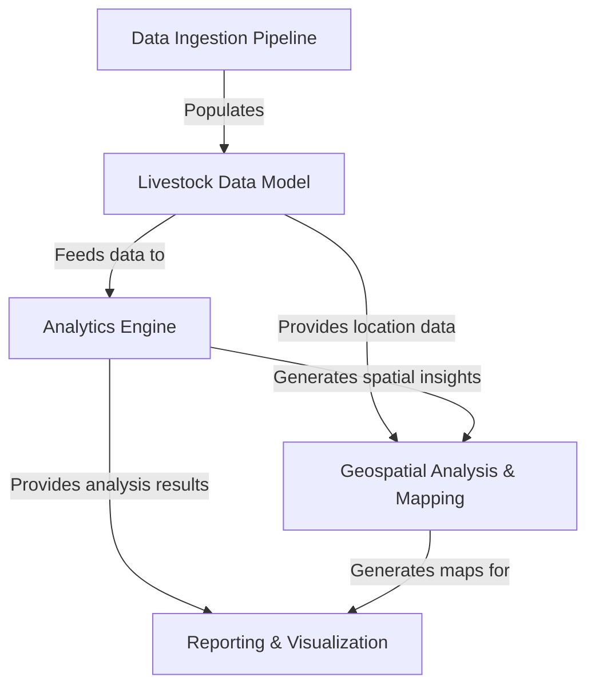

# Tutorial: Maharashtra-livestock-Analytics

This project is an advanced system designed to **understand and track livestock** across *Maharashtra*. It acts like a "smart farm manager" that **collects diverse animal and farm data**, then *cleans and organizes* it. With this structured data, it can **analyze patterns, predict trends, and pinpoint areas** of interest using *location intelligence*. Finally, all these complex insights are transformed into **easy-to-understand reports and maps** for decision-makers.

## Visual Overview

## Chapters

1. [Livestock Data Model
](01_livestock_data_model_.md)
2. [Data Ingestion Pipeline
](02_data_ingestion_pipeline_.md)
3. [Analytics Engine
](03_analytics_engine_.md)
4. [Geospatial Analysis & Mapping
](04_geospatial_analysis___mapping_.md)
5. [Reporting & Visualization
](05_reporting___visualization_.md)

---

Generated by [AI Codebase Knowledge Builder](https://github.com/The-Pocket/Tutorial-Codebase-Knowledge).
